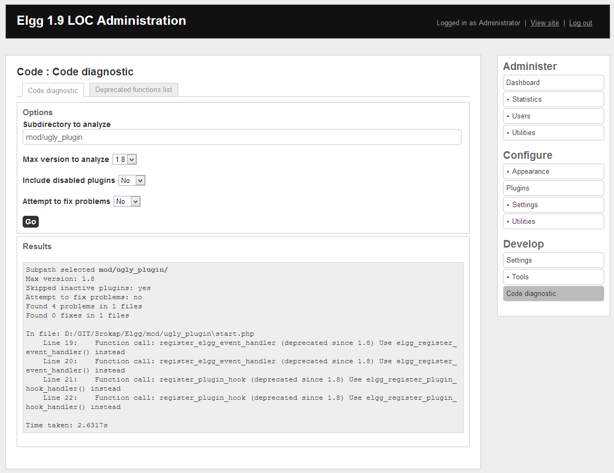

Code Analyzer    
==================

Plugin for PHP code analysis and refactoring of [Elgg](http://elgg.org/) plugins.

Requirements
-------------

- At the moment this plugin supports PHP >=5.3
- This plugin uses [PHP Reflection API](http://php.net/manual/en/book.reflection.php) and even though it's listed
explicitly in plugin requirements, it's a module that's bundled with all usual PHP deployments. If you're not doing
anything fancy, no worries.

Bugtracker
-------------

Please report all issues with this plugin itself on it's
[project page on github](https://github.com/Srokap/code_review/issues).

With issues found in analyzed plugins you should contact plugin author directly and give him all the details from
analysis results.

Screenshots
-------------

